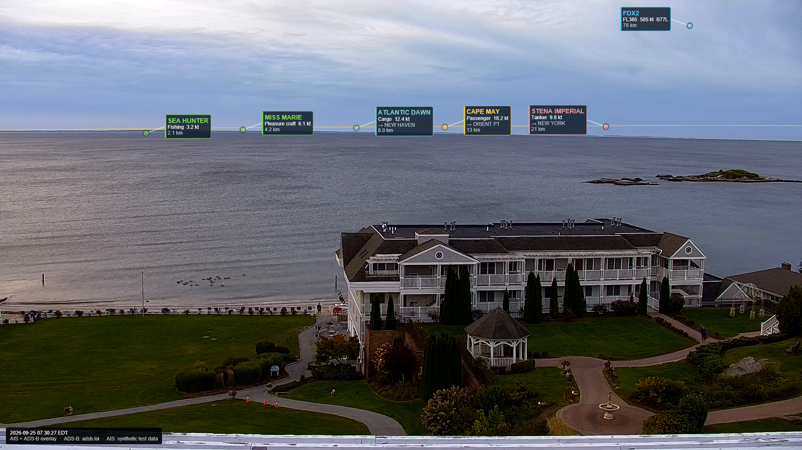

# Spotter

[](https://github.com/avery1227/Spotter/actions/workflows/ci.yml)
[](https://github.com/avery1227/Spotter/actions/workflows/publish.yml)
[](LICENSE)

Burns AR-style tracking labels for ships (AIS) and aircraft (ADS-B) into a fixed
camera's live stream, and re-streams the result over RTMP.

Built for a static camera looking over Long Island Sound from the Connecticut
shore, but nothing in it is specific to that site beyond `config.yaml`.



*Live ADS-B aircraft and (for this illustration) synthetic AIS vessels, drawn
with the example calibration. Ships are coloured by AIS type, aircraft in blue;
the thin orange line is the computed horizon.*

```
YouTube HLS ──▶ segment fetch ──▶ decode ──▶┐
                (PDT timing)                 │
                                             ├─▶ project ──▶ Skia overlay ──▶ ffmpeg ──▶ RTMP
ADS-B ─┐                                     │      ▲
AIS   ─┴─▶ normalise ──▶ track store ────────┘      │
                         (interpolate at            └── calibration.json
                          the frame's timestamp)
```

---

## The idea that makes it work

A label is only useful if it sits on the thing it names. That needs two things
to line up: **where** the camera is pointing, and **when** the frame was taken.

**Where** is the calibration: a solved camera model (pose, focal length,
distortion) fitted to landmarks you click once.

**When** is the part that is easy to get wrong. The stream you are watching is
not live — it is some tens of seconds behind reality. If you draw a target
where it is *now*, the label sits well ahead of the aircraft in the picture. So
every frame carries the wall-clock time it was **captured**:

```
frame time = segment EXT-X-PROGRAM-DATE-TIME
           + the frame's offset within that segment
           - stream.encoder_delay_s
```

and targets are resolved for *that* instant, not for now.

This is also why Spotter fetches HLS segments itself instead of handing the
playlist URL to ffmpeg: knowing exactly which segment a frame came from is what
makes the offset exact rather than a guess about how much libav buffered.

A pleasant side effect: because the pipeline runs ~25 s behind real time, by the
time a frame is drawn we usually already hold track reports from *after* it. So
positions are **interpolated between two known reports** rather than
extrapolated. Dead reckoning exists as a fallback, not the main path — which
matters most for AIS Class B, which can go 30 s or more between transmissions.

---

## Quick start

```bash
python -m venv .venv && . .venv/bin/activate      # Windows: .venv\Scripts\activate
pip install -r requirements.txt
cp config.example.yaml config.yaml    # your site's settings live here
```

You also need **ffmpeg** on `PATH`.

Then, in order:

```bash
# 0. Tell it roughly where the camera is (edit camera.lat/lon/height_m)
$EDITOR config.yaml    # or set it in the web UI, step 1

# 1. Calibrate in the browser: grab a frame, click landmarks, solve
python -m spotter web          #  ->  http://localhost:8090/

# 2. Check everything else is wired up
python -m spotter doctor

# 3. Run it, with the live monitor at http://localhost:8090/monitor
python -m spotter run --web
```

`python -m spotter run --duration 120` stops on its own, which is handy while
you are still tuning.

---

## Calibration workflow

This is the part that determines whether the labels land on anything. Budget
half an hour for it once; after that you should not need to touch it.

There are two ways to do it. **The web UI is the one to use** — it runs
anywhere, needs no desktop session on the machine hosting it, and lets you pick
the real-world position on a map instead of transcribing numbers. The OpenCV
window is kept for people who prefer it.

### Before you start

Set the camera's rough position in `config.yaml`:

```yaml
camera:
  lat: 41.2700          # EDIT: these ship as placeholders
  lon: -72.5000
  height_m: 15.0        # lens height above *sea level*, not above ground
```

Being 50–100 m out is fine — the solver refines position within soft priors.
Being 5 km out is not. Height matters more than you would expect: it sets the
horizon distance and trades off against pitch.

### The web UI

```bash
python -m spotter web          # http://localhost:8090/
```

Everything happens on one page:

1. **Grab fresh frame** pulls a still off the live stream. Do this in
   **daylight, in clear air** — a night IR frame hides the far shore, and haze
   hides exactly the distant landmarks that pin down focal length.
2. **Click the landmark in the frame.** A magnifier opens at 8×; the arrow keys
   nudge one full-resolution pixel at a time (shift for ten).
3. **Click the same spot on the map.** It defaults to satellite imagery, which
   makes jetties, breakwaters and rocks far easier to identify than a street
   map. Drag the marker to fine-tune.
   *Or* paste coordinates straight from Google Maps — right-click the spot,
   click the numbers at the top of the menu to copy, paste into the box. It
   accepts `41.276123, -72.459456`, the same with a space, and the
   `41°16'34.0"N, 72°27'34.0"W` form.
4. **Name it, set elevation, Add.**
5. Repeat six to twelve times, then **Solve**. You get pan, tilt, roll, focal
   length, field of view, distortion, height and position, with the per-point
   errors and any geometry warnings.
6. **Solve & save** writes `calibration.json` and the drift reference patches,
   then draws the reprojection back onto the frame — tick *show fit* and
   *horizon* to see how well it lands.

Points are written to `points.csv` as you go. Deleting one keeps a timestamped
backup under `state/points_history/` and offers an undo, because half an hour
of careful clicking should not be one misclick away from gone.

The UI has **no authentication**. It binds to localhost by default; only widen
`web.host` on a network you trust.

### The OpenCV window instead

```bash
python calibrate.py grab -o calib_frame.png
python calibrate.py click
```

This needs a desktop session and the GUI build of OpenCV (which is what
`requirements.txt` installs — the Docker image swaps in `opencv-python-headless`
because the container never opens a window). If you see *"The function is not
implemented. Rebuild the library with Windows, GTK+ 2.x or Cocoa support"*, you
have the headless build; use the web UI, or `pip install opencv-python`.

A window opens. Click a landmark; a magnified inset appears; nudge with the
arrow keys to the exact pixel; press Enter; type the name, latitude, longitude
and elevation on the terminal.

| key | does |
| --- | --- |
| left click | place a point |
| arrows / WASD | nudge one full-resolution pixel |
| Enter | accept, then type coordinates |
| Esc | cancel the pending point |
| `u` | undo the last point |
| `l` | list what you have so far |
| `+` / `-` / right-drag | zoom and pan |
| `s` | save and exit |
| `q` | quit without saving |

The zoom inset is not decoration: clicking a 1920-wide image in a window scaled
to fit a laptop screen costs about two full-resolution pixels of precision per
click, which is the same size as the errors you are trying to measure.

**What makes a good landmark**

* Something you can pin on a chart or in satellite imagery to a few metres:
  breakwater and jetty lights, channel buoys (they are charted), chimneys,
  radio masts, the corner of a pier, a distinctive rock or islet.
* **Mix near and far.** This is the single most common mistake. Points strung
  along the horizon leave pitch, height and focal length nearly degenerate —
  raising the camera and tilting it down look almost identical from 20 km away.
  Add a few things within a kilometre: the end of a jetty, a piling, a roof
  ridge, the seawall.
* **Spread them across the frame**, both sides and both heights. Radial
  distortion can only be fitted where you gave it data.
* Six to twelve is plenty. Twenty mediocre points are worse than eight good
  ones.
* Get elevations roughly right. For a light on the far shore it barely matters;
  for a rooftop 200 m away it matters a lot.

`points.example.csv` shows the file format. It contains **synthetic** points
generated for testing, not real landmarks — do not calibrate against it.

### Solving from the command line

```bash
python calibrate.py solve
```

Fits yaw, pitch, roll, focal length, radial distortion `k1`/`k2`, and a camera
position offset plus height, using `scipy.optimize.least_squares` with a robust
`soft_l1` loss so one mis-clicked point cannot drag the whole fit.

Position is held near your surveyed value by soft priors
(`calibration.solver.position_sigma_m`, `height_sigma_m`) rather than hard
bounds, so it can absorb a sloppy GPS fix without wandering across the county.

Output:

* `calibration.json` — the model, plus the fit report in its `meta`
* `calibration.report.json` — per-point errors and the leave-one-out analysis
* `state/drift_patches/` — reference patches for drift detection

It prints a per-point table and, importantly, **warnings**:

```
! 92% of points lie within 86px of the same height; add near-field points
  (a dock, a buoy, a rooftop) or pitch/height/focal will trade off against
  each other
! point 'far_shore_stack' looks wrong: dropping it takes the reprojection RMS
  from 47.9px to 1.3px. Re-check its lat/lon and the pixel you clicked
```

Read those. A fit with a beautiful RMS and a geometry warning is a fit that will
put labels in the wrong place on targets you did not calibrate against.

**On the leave-one-out report.** For each point it refits without that point and
records two numbers: how far off the held-out point lands, and the RMS of all
the *other* points. The second is what finds a mistyped coordinate. A bad point
does *not* show up as "its error grew when I left it out" — its in-fit error is
already large, so that difference is near zero. What gives it away is that
everything else gets dramatically better once it is dropped.

Useful flags: `--dry-run` (solve and print, write nothing), `--no-loo` (faster),
`-p other_points.csv`.

To exclude a suspect point without deleting it, set its `enabled` column to `0`
in `points.csv`.

### Checking the fit from the command line

```bash
python calibrate.py check --horizon --show
```

Writes `calib_check.png`: magenta crosses where you clicked, yellow circles
where the solved model reprojects them, and optionally the computed horizon.

Look for: circles sitting on crosses, and the horizon line lying along the
actual waterline. RMS under ~2 px is good; over ~6 px means something is wrong.

### Locking parameters

If you know a value exactly, fix it — every parameter you remove makes the rest
better determined:

```yaml
calibration:
  solver:
    lock_height: true      # you measured the lens height properly
    lock_position: true    # surveyed, not guessed
    lock_roll: true        # camera is definitely level
    lock_distortion: true  # rectilinear lens, or too few points to fit it
```

`k2` is locked automatically when you have fewer than six points, since it
cannot be identified from that few and will just absorb pose error.

---

## Tuning `encoder_delay_s`

`EXT-X-PROGRAM-DATE-TIME` tells you when the *publisher* stamped the segment. It
does not account for the camera owner's capture → encode → upload latency, which
is typically 5–20 s and is a property of their pipeline, not yours. So it has to
be measured by hand.

**Symptom:** labels sit consistently *ahead* of targets along their direction of
travel → `encoder_delay_s` is too small. Consistently *behind* → too large.

Use aircraft, not ships: at 200 m/s an error of one second is ~200 m, which is
obvious on screen. At 6 knots a ship barely moves.

### The quick way

```bash
python tools/tune_delay.py --min 4 --max 24 --step 2 --collect 120
```

This collects track history, grabs one frame, then draws where each candidate
delay would place every target — colour-coded and joined by a line. Open
`delay_sweep.png`, find an aircraft you can actually see, and read off the
number whose circle sits on it. That is your `encoder_delay_s`.

Collect for longer than your largest candidate delay plus the pipeline lag, or
the far end of the sweep will run off the front of your track history — the tool
tells you when that has happened.

### The manual way

Run the pipeline with the debug overlay and watch a plane cross the frame:

```bash
python -m spotter run --set render.debug.verbose_labels=true
```

Adjust in 2 s steps until the label rides on the aircraft. Then confirm with a
second aircraft going the other way — a consistent offset in *both* directions
is a delay error, while an offset that flips with heading is a calibration
error, not a timing one.

Expect to land somewhere between 8 and 20 s. It is worth re-checking after the
camera owner changes anything.

---

## Track sources

Sources are listed in priority order. **Exactly one runs at a time.** If the
active one fails repeatedly, Spotter demotes to the next; a background recheck
walks back up the list so a local receiver that came back takes over again.

Running only one at a time is deliberate: the public endpoints are a courtesy,
and polling all of them in parallel to throw away the results would be rude.

### ADS-B

```yaml
tracks:
  adsb:
    sources:
      - name: local-readsb
        type: readsb
        url: "http://127.0.0.1:8080/data/aircraft.json"
        poll_s: 1.0
      - name: adsb-lol
        type: adsb_lol
        poll_s: 5.0
```

A **local readsb / dump1090-fa** is by far the best option: one-second updates,
no rate limits, no dependency on anyone else. In Docker, reach a receiver on the
host at `http://host.docker.internal:8080/data/aircraft.json`.

**adsb.lol** works as a fallback but rate-limits aggressively. Measured, since
its docs say nothing about this: it sends **no rate-limit headers and no
`Retry-After`**, and the 429 comes from nginx as an HTML page, not from the
application. The limit behaves like ~1 request/second with a small burst.

So a steady 5 s poll is fine — what trips it is *bursts*. Spotter's poll
interval is adaptive: it doubles on a 429 up to `max_poll_s` and creeps back
down after clean polls. A slow poll costs nothing here, because frames are
rendered behind real time, so even a 10 s report still brackets every frame.

> If you see repeated 429s, check that a *higher-priority* source is not failing
> and forcing a restart every couple of minutes — each restart polls
> immediately, and that burst is what gets refused. `spotter doctor` will show
> a misconfigured source.

**airplanes.live** currently returns **HTTP 403 without credentials**. It is
left in the config as a last-resort entry; put a key in its `api_key` field if
you have one, otherwise expect it to be skipped.

### AIS

```yaml
tracks:
  ais:
    sources:
      - name: local-ais-catcher-http
        type: aiscatcher_http
        url: "http://127.0.0.1:8100/api/vessels.json"
      - name: local-nmea-udp
        type: nmea_udp
        bind_port: 10110
      - name: aisstream
        type: aisstream
        api_key: ""        # or set $AISSTREAM_API_KEY
```

Three ways in:

* **AIS-catcher over HTTP** — polls its JSON endpoint. Field names vary between
  versions, so the parser accepts several spellings.
* **Raw NMEA over UDP** — point AIS-catcher (or rtl-ais, or a hardware receiver)
  at this port. Spotter decodes AIVDM itself: message types 1/2/3 and 18
  (position), 5 and 19 and 24 (name, callsign, type, destination, dimensions),
  including multi-sentence reassembly.
* **aisstream.io** — websocket, filtered to the `region` bounding box. Needs a
  free API key.

A vessel's **name arrives separately from its position** — types 5 and 24 carry
no coordinates. Spotter remembers the static data and attaches it to that MMSI's
position, re-emitting at the original timestamp so a newly-arrived name does not
look like the ship just moved.

Note that the UDP listener never "fails" — it just sits there hearing nothing —
so it will not trigger failover. The on-screen attribution only credits a source
that has actually delivered reports, so a silent receiver is not advertised as
supplying data.

---

## Output

```yaml
output:
  rtmp_url: "rtmp://a.rtmp.youtube.com/live2/YOUR-STREAM-KEY"
  encoder: auto          # auto | libx264 | h264_nvenc | h264_qsv | h264_vaapi
  preset: veryfast
  bitrate: "6000k"
```

`auto` probes ffmpeg and prefers hardware (NVENC → QSV → VAAPI) over libx264.
Presets are translated per encoder — `veryfast` becomes NVENC's `p2`.

Resolution and frame rate match the source unless you override `video.*`.

**The output frame rate is held steady regardless of the input.** A writer
thread meters frames out at exactly the target rate; if the input stalls it
repeats the last frame and, after `output.stall.badge_after_s`, draws a
`RECONNECTING` badge. That same bounded queue back-pressures decoding, which is
what keeps memory flat — at 1080p one BGRA frame is 8 MB, so buffering a whole
segment would cost gigabytes.

Stream keys are redacted in logs.

For local testing, point `rtmp_url` at a file (`/tmp/out.mp4`) or run the
bundled MediaMTX:

```bash
docker compose --profile mediamtx up -d
python -m spotter run --set output.rtmp_url=rtmp://localhost:1935/live/spotter
# watch at http://localhost:8888/live/spotter
```

**Audio** is passed through untouched, remuxed from the same segments the video
came from, so it stays in sync without a re-encode. It reaches ffmpeg on a
second pipe via file-descriptor inheritance, which is **POSIX-only** — on
Windows Spotter logs a warning and runs video-only.

Three things about that path are worth knowing before changing it:

* libav strips the ADTS header when demuxing AAC out of MPEG-TS, so packets are
  re-wrapped before ffmpeg can read them as `-f aac`. The output stream must be
  created with `add_stream_from_template(source_stream)`; building it by name
  leaves the codec parameters at their defaults and the headers then encode the
  wrong sample rate and channel configuration (`channel element 2.8 is not
  allocated`). That is why the remuxer lives in the decoder, where the source
  stream is still open.
* ffmpeg opens its inputs in order and will not read a video frame until it has
  probed the audio pipe — but the only thing producing audio is the same decode
  loop that is blocked submitting video. So the first ~1.5 s of audio is
  buffered and flushed the moment the encoder starts, which satisfies the probe
  from the pipe buffer without the video path having to advance.
* That priming audio has no matching video, so the encoder is given a matching
  `-itsoffset`, computed from the primed AAC frame count. Without it the audio
  runs about a second and a half ahead of the picture for the whole stream.

---

## Web UI

```bash
python -m spotter web              # calibration + monitor, no pipeline
python -m spotter run --web        # pipeline + live monitor
```

Three pages:

* **`/`** — calibration (see above).
* **`/view`** — full-screen output for a wall display: just the picture, with
  a stats panel and key hints that fade out after a few seconds. <kbd>F</kbd>
  fullscreen, <kbd>S</kbd> stats, <kbd>C</kbd> fit/fill, <kbd>R</kbd>
  reconnect. It reconnects on its own when the stream drops, watches the
  server's frame counter to catch a socket that died quietly, and takes a
  screen wake lock so the monitor does not sleep. Query parameters:
  `?width=1920&fps=10&quality=80&stats=0&fill=1`.
* **`/monitor`** — the composited output as it is being streamed, plus pipeline
  health: frame rate, render cost, how far behind real time the frames are,
  encoder state, reconnects, track counts, the cull breakdown (how many targets
  were behind the camera, off-frame, out of range, below the horizon) and drift
  status. The preview is MJPEG; switch it to a still, change the width, or grab
  a full-resolution snapshot.

Watching never slows down streaming. Publishing a frame to the preview is an
attribute assignment, not a copy, and the JPEG encode happens outside any lock
the render loop needs — three concurrent viewers at 10 fps cost under 1 fps of
pipeline throughput. The preview is also rate-limited well below the real frame
rate (`web.preview_fps`, default 6), because encoding 1080p JPEG at 30 fps
would cost more CPU than the H.264 encode itself.

```yaml
web:
  enabled: false        # true = always start the UI with `spotter run`
  host: "127.0.0.1"     # NO AUTHENTICATION - only widen on a trusted network
  port: 8090            # NOT 8080: readsb/tar1090 conventionally use that
  preview_width: 960
  preview_quality: 70
  preview_fps: 6
```

In Docker the UI is published on `127.0.0.1:8090` and the container listens on
`0.0.0.0` so the published port reaches it.

---

## Drift detection

The camera "essentially never moves", but mounts sag and housings get bumped, and
a few pixels of shift is enough to put a label on the wrong ship at 20 km.

`calibrate.py solve` saves image patches around the best-textured, most
spread-out landmarks. Every `drift.check_interval_s` Spotter template-matches
them in the live frame near where they used to be, and takes the **median**
shift — median so one patch landing on a moving boat or a waving tree cannot
move the answer.

```yaml
drift:
  check_interval_s: 60.0
  warn_shift_px: 6.0
  consecutive_checks: 3        # haze, rain and low sun all cause transient misses
  hide_labels_on_drift: false  # true = stop drawing labels until you recalibrate
```

Exceeding the threshold once does nothing. Exceeding it `consecutive_checks`
times logs a warning and puts a `CALIBRATION DRIFT` badge on screen. A check
where fewer than two patches matched is reported as inconclusive and does not
count either way.

---

## Offline test mode

Tune the overlay without depending on the live stream, repeatably:

```bash
python -m spotter record-clip  -d 60          # data/offline/clip.mp4
python -m spotter record-tracks -d 120        # data/offline/tracks.jsonl
```

`record-clip` prints the `offline.start_time` to set. Then:

```yaml
offline:
  enabled: true
  video: ./data/offline/clip.mp4
  tracks: ./data/offline/tracks.jsonl
  start_time: "2026-09-25T10:45:08+00:00"
  speed: 1.0
  loop: true
```

```bash
python -m spotter run --set output.rtmp_url=/tmp/offline_test.mp4
```

Recorded reports are released only as the clip's clock reaches them, so the
store contains exactly what it would have held live — including the gaps.
Feeding everything up front would make interpolation look better than it is.

---

## What it needs to run

**No GPU.** The default encoder is software `libx264`; `auto` only picks
NVENC/QSV/VAAPI if they happen to exist. Skia renders in software too — the
overlay is raster, not GL.

**No desktop.** Everything runs headless. The one exception is
`calibrate.py click`, which opens an OpenCV window — and the web UI exists
precisely so you never need it.

Measured on one 1080p30 source, software x264 `veryfast`, inside a
CPU-limited container:

| source | CPU used | RAM | verdict |
| --- | --- | --- | --- |
| 1080p30 | ~2.3 cores | ~500 MB | give it **3–4 cores**; 2 is not enough (20 fps of 30, lag grows) |
| 720p30  | ~1.7 cores | ~300 MB | fits in **2 cores / 768 MB** |

If you are tight on CPU, `--set stream.quality=720p` is the biggest single
lever. Hardware encoding is the next one.

Beyond that it needs **ffmpeg**, and the shared libraries `skia-python` and
OpenCV link against — `libEGL`, `libGL`, `libglib2.0`, `libfontconfig`,
`libfreetype`. The Dockerfile installs them; on bare Ubuntu:

```bash
sudo apt install ffmpeg libegl1 libgl1 libgles2 libglib2.0-0                  libfontconfig1 libfreetype6 fonts-dejavu-core
```

### Pelican Panel / Pterodactyl

Supported directly. There is a ready-made egg and a dedicated image target:

```bash
docker build --target pelican -t spotter:pelican .
```

Import [`pelican/egg-spotter.json`](pelican/egg-spotter.json), point it at
`ghcr.io/avery1227/spotter:latest-pelican`, and give the server one TCP allocation.
Start in `STARTUP_MODE=web` to calibrate, then switch to `run`.

The Pelican image follows wings' conventions: the app stays read-only in
`/opt/spotter` while `/home/container` holds only your config, calibration and
state, so pulling a newer image never touches a calibration. See
[`pelican/README.md`](pelican/README.md).

---

## Deployment

### Docker

```bash
cp .env.example .env && $EDITOR .env      # RTMP_URL, AISSTREAM_API_KEY, TZ
docker compose up -d spotter
docker compose logs -f spotter
```

The image runs as a non-root user with a read-only root filesystem; `state/` and
`data/` are the only writable mounts. `config.yaml`, `calibration.json` and
`points.csv` are bind-mounted read-only, so editing them on the host needs no
rebuild. The healthcheck runs `spotter doctor`.

For VAAPI, uncomment the `devices:` block and set `output.encoder: h264_vaapi`.
For NVENC, install the NVIDIA container toolkit and uncomment the `deploy:`
block.

### systemd

`systemd/spotter.service` runs it directly; `systemd/spotter-compose.service`
manages the Compose stack. Both restart on failure with a rate limit, so a
genuinely broken configuration fails visibly instead of looping hot.

Logs are line-delimited JSON (`logging.format: json`), which the journal and
Loki both handle well. Use `--log-format console` while working interactively.

---

## Command reference

```
python -m spotter run [--duration N]     run the pipeline
python -m spotter run --web              ... with the live monitor
python -m spotter web                    calibration + monitor UI only
python -m spotter doctor                 check config, calibration, ffmpeg, sources
python -m spotter record-clip -d 60      record a clip for offline mode
python -m spotter record-tracks -d 120   record track data for offline mode

python calibrate.py grab                 grab a still from the stream
python calibrate.py click                click landmarks -> points.csv
python calibrate.py solve                fit the model -> calibration.json
python calibrate.py check --horizon      draw the fit back onto the still

python tools/tune_delay.py               sweep encoder_delay_s
```

Any config value can be overridden from the command line, before or after the
subcommand:

```bash
python -m spotter run --set render.max_labels=12 --set output.enabled=false
```

---

## Debug overlays

```yaml
render:
  debug:
    draw_landmarks: true    # clicked vs reprojected calibration points
    draw_horizon: true      # the computed horizon line
    verbose_labels: true    # range, bearing, elevation, and interpolation mode
```

`verbose_labels` shows each target's position mode — `interpolated`,
`dead_reckoned` or `held`. If you see a lot of `dead_reckoned`, your track feed
is not keeping up with the pipeline, or `encoder_delay_s` is smaller than the
real latency.

---

## Troubleshooting

**Labels are consistently ahead of moving targets.**
`encoder_delay_s` is too small. See the tuning section.

**Labels are offset in a direction that flips with the target's heading.**
That is not timing, that is calibration. Re-run `calibrate.py check`.

**Labels drift further off the further away the target is.**
Focal length or distortion. Add landmarks at a range of distances — especially
near-field ones — and re-solve.

**Everything is offset by a constant number of pixels.**
The camera moved. Check the drift log; recalibrate.

**Ships appear that should be hull-down over the horizon.**
Check `camera.height_m` — it is above *sea level*, not above the roof you
measured from. Too large a value pushes the horizon out.

**No ships at all.**
`spotter doctor` will tell you whether any AIS source is actually delivering.
With no local receiver and no aisstream key, there is no AIS data — the UDP
listener binds happily and hears nothing.

**`HTTP 429` from adsb.lol.**
You are polling too fast, or sharing an IP with someone who is. Raise `poll_s`.
A local receiver removes the problem entirely.

**Output stutters at segment boundaries.**
Should not happen — the decoder is flushed at the end of every segment. If it
does, check `decode_errors` in the status log.

**`calibrate.py click` says "The function is not implemented".**
That is the headless OpenCV build, which has no GUI. Use the web UI
(`spotter web`), or `pip install opencv-python`.

**The web UI shows no frame.**
Press *Grab fresh frame*. If that times out, the stream is unreachable —
`spotter doctor` will say more.

**The monitor says "pipeline not running".**
`spotter web` alone serves the UI but runs no pipeline. Use
`spotter run --web` to see live output.

**No audio in the output.**
On Windows this is expected (see Output). On Linux, check the log for
`audio passthrough` lines: Spotter falls back to video-only rather than losing
the stream if ffmpeg refuses the audio input, and says so when it does.

**`moov atom not found` when writing to an `.mp4` file.**
The process was killed rather than stopped. Use `--duration`, or Ctrl-C, or
write to `.ts` instead, which tolerates truncation.

---

## Layout

```
spotter/
  ingest/      resolver, M3U8 parsing, segment fetch, decode, frame grab
  tracks/      model, store (interpolation/dead reckoning), ADS-B, AIS, NMEA,
               source failover, manager
  calib/       camera model, control points, solver
  render/      theme, declutter, Skia overlay
  web/         Flask API, calibration page, live monitor
  output/      ffmpeg encoder and paced writer
  geodesy.py   ENU, refraction, horizon
  projection.py  project and cull
  drift.py     template-match drift detection
  pipeline.py  the frame loop
  offline.py   offline clip + recorded track replay
  cli.py       python -m spotter
calibrate.py   calibration workflow
tools/         tune_delay.py
tests/         pytest suite
```

```bash
pip install -r requirements-dev.txt
pytest -q
```

---

## Known limitations

* `airplanes.live` returns 403 without credentials.
* Audio passthrough is POSIX-only (it needs fd inheritance for a second pipe).
  It also assumes AAC in the source, which is what YouTube's HLS delivers.
* The principal point is fixed at the image centre. Solving it as well is
  ill-conditioned with a handful of hand-clicked points and trades off against
  yaw and pitch.
* Distortion is radial only (`k1`, `k2`) — no tangential terms.
* `points.example.csv` and `calibration.example.json` are **synthetic test
  fixtures**, not a real calibration of any camera.
* A fisheye lens is not modelled; the solver bounds focal length to reject the
  degenerate fits that would imply.
